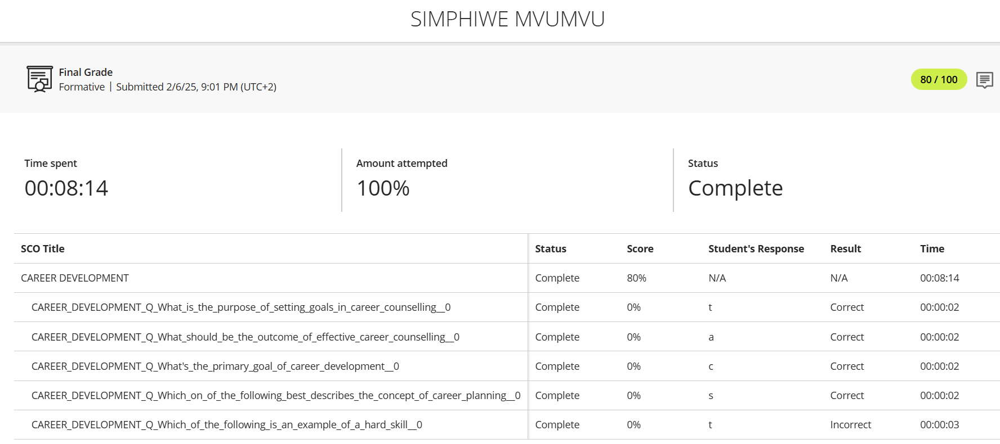
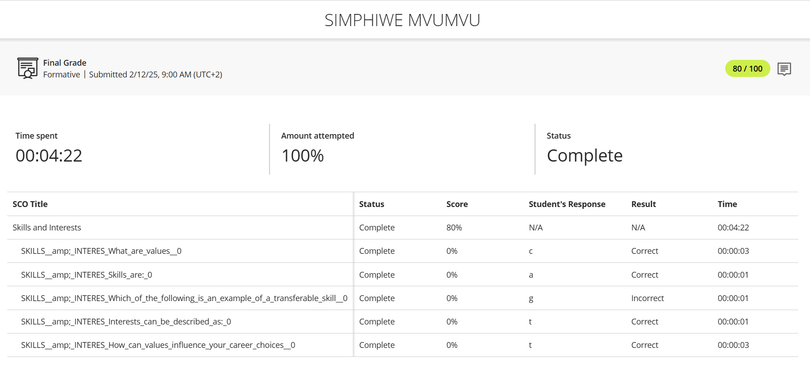
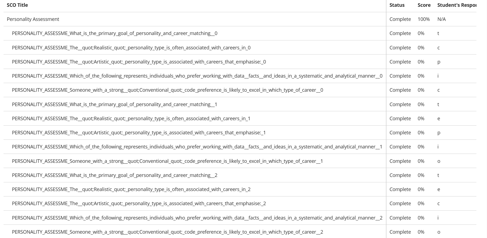
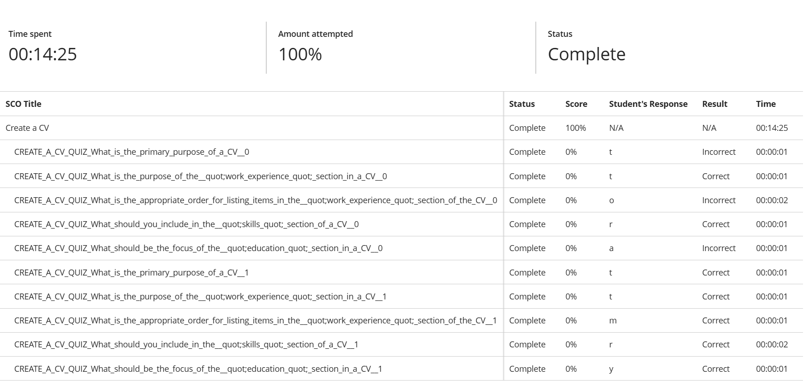

# Digital Portfolio: Simphiwe Mvumvu 

**Intern Front-End Developer @ Plum Systems**  
Final year Multimedia Applications student | Web Developer | Focused on Growth  

---

## About Me

Hi there! I'm **Simphiwe Mvumvu**, a front-end development intern at **Plum Systems** and a final-year Multimedia Applications student at CPUT. I'm passionate about turning complex problems into clean, responsive user interfaces using tools like React, Angular, JavaScript, and good old HTML/CSS.

What you're seeing here is more than just a portfolio, it's a snapshot of my journey: what I've learned, the steps I've taken to grow, and how I'm applying it all in the real world. This digital portfolio is aligned with a formal rubric that measures both technical evidence and self-reflection through the STAR (Situation, Task, Action, Result) technique.

---

## Portfolio Progress Overview

**Completion Status: 12 of 19 modules completed**

### Completed Modules
- PRP37X5 SUBJECT GUIDE
- Student Acknowledgement  
- CAREER DEVELOPMENT
- Skills and Interests
- Personality Assessment
- Create a CV
- CV Submission
- Business Communication
- Interview Skills
- Mock Interview Video
- Professional Networking
- Workplace Etiquette

### Pending Modules
- ◻️ WIL-DPDX
- ◻️ Job Search

---

## Career Counselling

**Evidence**  
  
- Reflection journal from group coaching sessions  
- Personal career roadmap  

**Reflection (STAR Technique)**  
**S**: Before starting my internship, I felt overwhelmed by the range of roles in tech and unsure where I belonged.  
**T**: I joined a career counselling program to figure out a path that matches both my personality and strengths.  
**A**: I went through values exercises, skill discovery workshops, and used the knowledge I gained to become better at what I do.  
**R**: I discovered a natural alignment with front-end development—creative, technical, and user-centered. That clarity helped me apply confidently for internships and led to my current role at Plum Systems.

---

## Skills and Interests

**Evidence**  
  
- Skills matrix highlighting frontend and backend capabilities  
- Visual mind map of my interests in UX, UI, accessibility, and component-driven development  

**Reflection (STAR Technique)**  
**S**: I wanted to understand not just what I could do, but what I genuinely *enjoyed* doing.  
**T**: I used various self-assessment tools and project feedback to evaluate my strengths.  
**A**: I listed out my current tools—HTML, CSS, Bootstrap, JavaScript, React, Angular—and added my backend exposure to Node.js, Express, and MongoDB. I also asked peers and mentors where they thought I shine.  
**R**: It became clear that I thrive when designing and coding interactive UIs, especially when I can bring my ideas to life with JavaScript or React. My interest in building seamless, accessible interfaces grew stronger.

---

## Personality Assessment

**Evidence**  
  
- MBTI results and teamwork profile  
- Summary of personality strengths relevant to development roles  

**Reflection (STAR Technique)**  
**S**: I've always been curious about how personality influences collaboration in tech teams.  
**T**: I wanted to find out how I naturally work and communicate, especially in high-pressure or team-based environments.  
**A**: I completed multiple personality assessments and matched the results to common tech roles. I'm a logical thinker but also very empathetic, which was an interesting combo.  
**R**: I realized I'm someone who values structure but also adapts quickly. That explains why frontend fits so well—I enjoy solving layout and interaction challenges while keeping the user in mind. Plus, I now know how to present myself better in team interviews and retrospectives.

---

## Create A CV

**Evidence**  
  
- My CV (tailored for web dev roles) in PDF and DOCX formats  
- Feedback notes from mentors and peers  

**Reflection (STAR Technique)**  
**S**: My original CV was more of a school project than a professional document. I knew it needed a complete upgrade.  
**T**: I aimed to build a CV that clearly shows my tech skills, internship experience, and certifications.  
**A**: I rewrote the layout, included relevant projects and tech stacks, and got feedback from my internship manager and classmates.  
**R**: I now have a modern, well-structured CV that helped me apply for internships confidently—and it played a part in getting hired at Plum Systems. It's also something I keep updating after every milestone.

---

## CV Submission

**Evidence**  
[CV Submission Certificate (PDF)](cv-submission.pdf)  
- Email templates and cover letter samples I created  
- Job tracker spreadsheet (with dates, contacts, feedback)  

**Reflection (STAR Technique)**  
**S**: Submitting a CV sounds simple, but I quickly learned there's a smart way to do it.  
**T**: I wanted to develop a system for applying to jobs that was organized, professional, and adaptable.  
**A**: I created different versions of my CV, wrote templates for cover letters, and tracked where I sent each application. I also followed up on interviews.  
**R**: This process helped me stay focused and confident. One of those CVs ended up with Plum Systems, and here I am—gaining real industry experience and growing every day.

---

## Business Communication

**Evidence**  
  
- Professional email correspondence samples  
- Meeting minutes and presentation materials  

**Assessment Results: 100/100**  
**Status: Completed with excellence**

**Reflection (STAR Technique)**  
**S**: As I transitioned into professional environments, I needed to adapt my communication style from academic to business-appropriate.  
**T**: My goal was to master professional written and verbal communication for tech workplace settings.  
**A**: I practiced writing clear project emails, participated in team meetings, and learned to present technical information to non-technical stakeholders.  
**R**: I now communicate confidently with team members and managers, and my professional approach contributed to positive performance reviews during my internship.

---

## Interview Skills

**Evidence**  
  
- Interview preparation notes and question bank  
- Recording of practice technical interviews  

**Assessment Results: 80/100**  
**Status: Completed - Proficient level**

**Reflection (STAR Technique)**  
**S**: Technical interviews initially felt intimidating, especially coding challenges under time pressure.  
**T**: I needed to develop a systematic approach to technical and behavioral interviews.  
**A**: I practiced common algorithms, prepared STAR stories for behavioral questions, and did mock interviews with peers.  
**R**: While there's always room to improve, my preparation helped me successfully navigate the interview process at Plum Systems and handle technical questions with more confidence.

---

## Mock Interview Video

**Evidence**  
  
- Recorded mock technical interview  
- Self-assessment and feedback documentation  

**Status: Completed**  
**Due: March 21, 2025**

**Reflection (STAR Technique)**  
**S**: I needed authentic practice in a high-pressure interview simulation.  
**T**: Create and analyze a recorded mock interview to identify strengths and areas for improvement.  
**A**: I prepared as for a real interview, recorded my session, then reviewed it critically with mentors.  
**R**: The video revealed I was well-prepared technically but needed to work on pacing and clarity when explaining complex concepts—valuable insights I've since applied.

---

## Professional Networking

**Evidence**  
  
- LinkedIn profile optimization screenshots  
- Event attendance records and connection notes  

**Assessment Results: 100/100**  
**Status: Completed with excellence**

**Reflection (STAR Technique)**  
**S**: I recognized that technical skills alone aren't enough—building professional relationships is crucial for career growth.  
**T**: Develop an active professional network in the tech industry.  
**A**: I optimized my LinkedIn profile, attended virtual tech meetups, connected with developers, and engaged in meaningful conversations.  
**R**: My network has grown to include experienced developers who provide mentorship, and I've discovered job opportunities I wouldn't have found otherwise.

---

## Workplace Etiquette

**Evidence**  
  
- Team collaboration guidelines  
- Professional conduct self-assessment  

**Assessment Results: 80/100**  
**Status: Completed - Proficient level**  
**Due: March 28, 2025**

**Reflection (STAR Technique)**  
**S**: Transitioning from academic to professional environments required understanding unwritten workplace rules.  
**T**: Learn and apply professional workplace behaviors in a tech company setting.  
**A**: I observed senior colleagues, asked for feedback on my professional conduct, and adapted to company culture norms.  
**R**: I've become more effective in team settings, understand professional boundaries, and contribute positively to workplace culture at Plum Systems.

---

## Tech Skills

**Front-End:**  
`HTML`, `CSS`, `Bootstrap`, `JavaScript`, `React`, `Angular`

**Back-End:**  
`Node.js`, `Express.js`, `MongoDB`

**Tools & Methods:**  
`Git`, `GitHub`, `Agile Methodology`, `Responsive Design`, `REST APIs`

---

## Academic Performance Summary

| Module | Grade | Status |
|--------|-------|--------|
| Business Communication | 100/100 | Excellent |
| Interview Skills | 80/100 | Proficient |
| Professional Networking | 100/100 | Excellent |
| Workplace Etiquette | 80/100 | Proficient |

**Overall Performance: Consistently meeting or exceeding expectations**

---

## Next Steps & Goals

### Immediate Focus
- Complete remaining WIL-DPDX requirements
- Finalize Job Search preparation
- Graduate with strong academic record

### Career Objectives
- Secure full-time front-end developer position
- Deepen React and Angular expertise
- Contribute to open-source projects
- Mentor other aspiring developers

---

*This portfolio documents my growth journey through the Work-Integrated Learning program, demonstrating both technical competency and professional development.*
